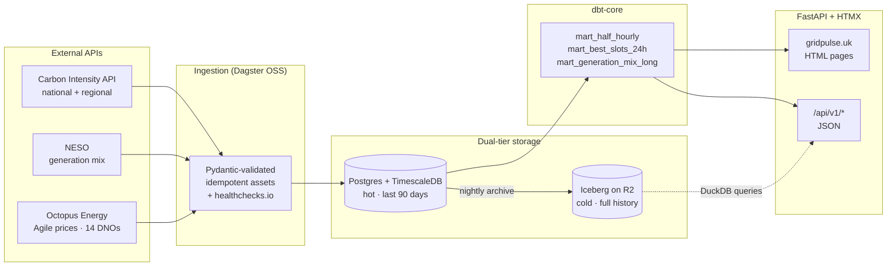
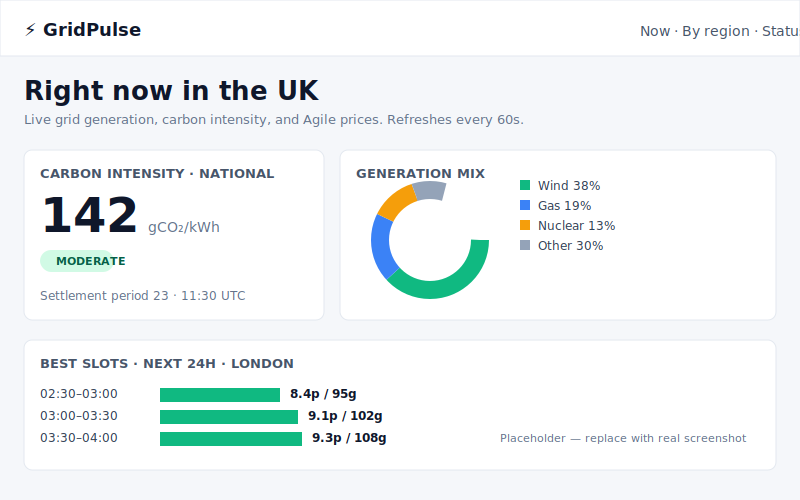
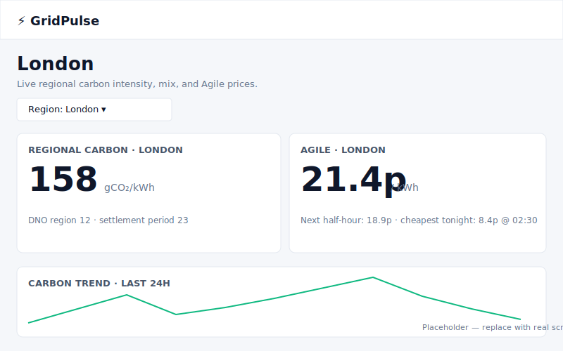
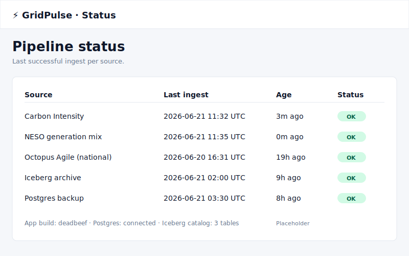
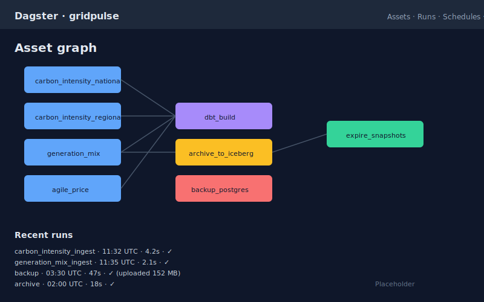

# GridPulse

> Real-time UK energy intelligence platform — live grid data, electricity prices, and "when should I run the dishwasher tonight" recommendations. Built as a portfolio project to demonstrate end-to-end modern data engineering.

🌐 **Live:** [gridpulse.uk](https://gridpulse.uk) · 📊 **Status:** [gridpulse.uk/status](https://gridpulse.uk/status) · 🛠 **API docs:** [gridpulse.uk/docs](https://gridpulse.uk/docs)

---

## What it does

Ingests live UK grid generation, carbon intensity, and Octopus Agile electricity prices from public APIs every few minutes, joins them, and serves two front doors from one platform:

- **Consumer view** — when is energy cheapest tonight? Greenest? What's the best half-hour slot to charge an EV?
- **Analyst view** — live generation mix, regional carbon intensity, year-over-year trends.

## Stack at a glance

| Layer | Choice |
|---|---|
| Ingestion | Python · `httpx` · `tenacity` · `pydantic` |
| Orchestration | Dagster OSS |
| Hot store | Postgres 16 + TimescaleDB (90 days) |
| Cold lakehouse | Apache Iceberg on Cloudflare R2 |
| Transformations | dbt-core |
| Query engine (lakehouse) | DuckDB |
| API | FastAPI |
| UI | HTMX + Jinja2 + PicoCSS + Chart.js |
| Infra | Hetzner CAX21 · Docker Compose · Terraform · GitHub Actions |
| Monitoring | Grafana Cloud · Sentry · healthchecks.io |

**Total cost: ~£8/month.** Yes, all-in.

## Architecture



**Why dual storage?** Postgres serves sub-second user queries; Iceberg is the cheap, infinite-scale lakehouse for backtesting and ML. Same data, two access patterns. See [`docs/lakehouse-design.md`](./docs/lakehouse-design.md).

## Screenshots

| Landing — UK now | Regional — London | Status |
|:---:|:---:|:---:|
|  |  |  |

Dagster orchestration UI showing assets + schedules:



> Stylised placeholders — swap in real PNG captures from the live site once you have them; the layout mirrors what the production pages serve.

## Run locally in 60 seconds

Prerequisites: Docker Desktop + a recent `uv`.

```bash
git clone https://github.com/naspuka/gridpulse.git
cd gridpulse
cp .env.example .env             # defaults work; fill external creds only if you want live ingest
make up                          # builds + boots Postgres, Dagster, app, Caddy
make migrate                     # applies SQL schema + Timescale hypertables
make seed                        # one synthetic day so the UI isn't empty
```

Then:

- **UI:** <http://localhost> — the landing page should render with the seeded data
- **API:** <http://localhost/docs> — auto-generated OpenAPI
- **Dagster:** <http://dagster.localhost> — materialise any asset to ingest fresh real data

`make help` lists every target. Tear down with `make down`.

## Documentation

Design source-of-truth lives in `docs/`. Read these before suggesting architectural changes:

- [`architecture.md`](./docs/architecture.md) — 5-layer diagram + process topology
- [`data-contracts.md`](./docs/data-contracts.md) — pydantic conventions per source
- [`database-design.md`](./docs/database-design.md) — Postgres schemas, hypertables, marts, upsert SQL
- [`lakehouse-design.md`](./docs/lakehouse-design.md) — Iceberg catalog, partitioning, snapshots
- [`api-design.md`](./docs/api-design.md) — HTML + JSON endpoints, caching, rate limits
- [`infra-design.md`](./docs/infra-design.md) — Compose, Caddy, Terraform, secrets, CI/CD
- [`runbooks/restore.md`](./docs/runbooks/restore.md) — Postgres restore from R2 backup
- [`decisions-log.md`](./docs/decisions-log.md) — append-only "why" log
- [`PROJECT_BRIEF.md`](./docs/PROJECT_BRIEF.md) — the original ideation doc

[`IMPLEMENTATION.md`](./IMPLEMENTATION.md) — build plan with phase checkboxes.
[`CLAUDE.md`](./CLAUDE.md) — binding conventions for any contributor (human or AI).

## About this project (long version)

End-to-end data platform that ingests UK Carbon Intensity, NESO generation mix, and Octopus Agile prices (14 DNO regions) every few minutes, joins them in a hot/cold storage tier, and serves both a live consumer view ("greenest/cheapest half-hour tonight") and a JSON API. Runs on a single Hetzner ARM VM for ~£8/month all-in.

### What I built

- **Ingestion (Dagster OSS).** Three asset families with `pydantic`-validated contracts, idempotent upserts on natural keys, retries via `tenacity`, and per-asset heartbeats to healthchecks.io. Schedules cover 5–30 minute cadences with DST-correct handling of 46/50 settlement-period days.
- **Dual-tier storage.** Postgres 16 + TimescaleDB hypertables for the hot 90-day window (sub-second user queries); Apache Iceberg on Cloudflare R2 via PyIceberg for the full historical lakehouse, partitioned by day. Nightly Dagster jobs archive Postgres → Iceberg and weekly jobs expire old snapshots to control R2 storage.
- **Transformations (dbt-core).** Staging models per source feed mart tables (`mart_half_hourly`, `mart_best_slots_24h`, `mart_generation_mix_long`) joined on settlement period; `dbt test` enforces not-null, uniqueness, accepted values, and referential integrity. Runs as a Dagster asset.
- **Serving layer (FastAPI + HTMX).** Server-rendered Jinja2 templates with partials swapped every 60s via HTMX — no client framework. `cachetools` TTL caches in front of Postgres, `slowapi` rate limiting on `/api/v1/*`, OpenAPI auto-docs.
- **Infrastructure as code.** Terraform provisions the Hetzner VM (CAX21 ARM) and Cloudflare resources (DNS, R2 bucket). Docker Compose orchestrates app + Dagster + Postgres + Caddy (TLS). GitHub Actions CI runs ruff, mypy strict, pytest, and `dbt build`; the deploy workflow builds multi-arch images for arm64, pushes to GHCR, and updates the box over SSH with smoke tests against `/healthz`.
- **Observability + reliability.** Sentry for unhandled exceptions with release tracking tied to git SHA; Grafana Cloud free tier (Grafana Agent + node + postgres exporters + Loki) for metrics and container logs; nightly `pg_dump` → R2 with a 30-day lifecycle policy and an automated restore-drill script that verifies backups end-to-end.

### Engineering decisions worth talking about

- **Iceberg over Delta** for 2026 ecosystem momentum and PyIceberg maturity; **Postgres + Iceberg dual tier** because each tells a different production story (sub-second serving vs cheap infinite history).
- **No Kafka in V1** — energy data refreshes every 5–30 minutes, so scheduled Dagster assets are functionally indistinguishable from streaming at a fraction of the cost; preserved the interview answer for when I *would* add it.
- **HTMX + Jinja over React** — kept 90% of engineering time on pipelines, which is what the project is meant to demonstrate.
- **Hetzner + R2 over AWS** — ~5–10× cheaper once egress is priced in; documented the cloud-equivalent architecture (RDS, Redpanda, Snowflake/Databricks, Unity Catalog) for the "what would you do at scale?" question.

### Outcomes

Six-weekend solo build covering ingestion, orchestration, lakehouse, transformations, serving, IaC, CI/CD, observability, backups, and a tested restore runbook. Public repo with architecture diagram, decisions log, and full design docs in `docs/`. Total monthly run cost: ~£8.

## Attributions

- Carbon intensity data from the [Carbon Intensity API](https://carbonintensity.org.uk), licensed [CC BY 4.0](https://creativecommons.org/licenses/by/4.0/).
- Generation mix data from [NESO](https://www.neso.energy).
- Tariff data from [Octopus Energy](https://octopus.energy).

## License

MIT — see [LICENSE](./LICENSE).
